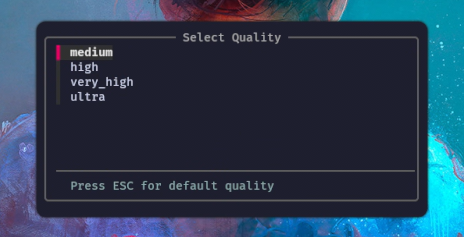
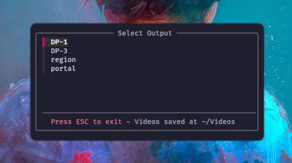

<br /><br />

Screen recording selector for Hyprland using `gpu-screen-recorder`

Use `SUPER+SHIFT+R` to start recording, choose an output and quality of choice, then use the same bind again to stop. Recordings are saved to `~/Videos`, and the output file is copied to the clipboard when recording stops if `wl-copy` is installed

### Installation
Dependencies using `yay`:
```sh
yay -S --needed gpu-screen-recorder kitty fzf slurp libnotify waybar wl-clipboard
```

Clone and install:
```sh
git clone https://github.com/conditionull/screen-rec-selector.git
cd screen-rec-selector
./install.sh
```
<br />

### Hyprland setup
bind:

```lua
hl.bind(mainMod .. " + SHIFT + R", hl.dsp.exec_cmd("selector.sh"))
```

window rules for the picker and authentication prompt:

```lua
hl.window_rule({ match = { initial_class = "recorder-picker" }, float = true, center = true, size = { 500, 250 }, stay_focused = true })

hl.window_rule({ match = { class = "recorder-auth" }, float = true, center = true, size = { 675, 215 }, opacity = "1 0.8" })
```
<details>
<summary>Authentication info</summary>

The auth window only appears if gsr-kms-server is missing the permission it needs for KMS screen capture.

Enter your password once and the script will apply:

```sh
sudo setcap cap_sys_admin+ep /usr/bin/gsr-kms-server
```

After that, recordings should start without asking for your password again.

You may see the prompt again if gpu-screen-recorder updates or reinstalls, because /usr/bin/gsr-kms-server can be replaced and lose the permission.

gsr-kms-server is the small helper used by gpu-screen-recorder to capture the screen through KMS. Linux normally locks that behind admin permission, so setcap gives only this helper the permission it needs instead of asking for your password every time you record.

More info:

- [gsr-kms-server manual](https://man.archlinux.org/man/extra/gpu-screen-recorder/gsr-kms-server.1.en) - what the helper is
- [ArchWiki capabilities](https://wiki.archlinux.org/title/Capabilities) - what `setcap` and `cap_sys_admin` are
</details>
<br />

### Waybar

Add the recording status module to your waybar setup, e.g.:

```json
"modules-right": [
  "custom/recording_status",
  "tray",
  "memory",
  "cpu",
  "wireplumber"
]
```
```json
"custom/recording_status": {
  "exec": "recording_status.sh",
  "interval": 1,
  "return-type": "json",
  "format": "{text}",
  "tooltip-format": " End recording: SUPER+SHIFT+R "
}
```
```css
#custom-recording_status {
  border-radius: 8px;
  margin: 4px 4px;
  padding: 6px 10px;
  color: #ff5555;
  background-color: #1e1e2e;
  font-weight: 600;
  font-size: 12.5px;
}
```

My waybar styling lives here, use it as a reference if you want: [conditionull/i-do-it-my-waybar](https://github.com/conditionull/i-do-it-my-waybar/tree/main)
<br /><br />

### Other
The bind acts as a toggle; run it to start/stop the recording

Notifications are mostly disabled because the waybar module shows the recording duration, uncomment the `notify-send` lines in `selector.sh` if you prefer notification daemon messages!
<br /><br />

<details>
  <summary>Additional previews</summary>

https://youtu.be/187pir6Y8ek



</details>

